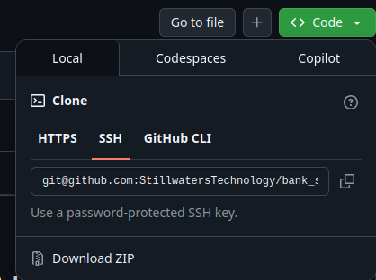

# Bank Statement PDF to Excel Converter

Convert your bank statement PDFs into clean, structured Excel or CSV files with ease.
This has been designed and tested on UK bank statements, but it may be compatible with other English language statements.  Please try it and let us know if it is!

## Compatible Statements
- HSBC Personal Current Accounts
- HSBC Advance Current Accounts
- HSBC Instant & Flexible Savings Accounts
- HSBC Online Bonus Saver Accounts

## Coming soon...
- HSBC Credit Cards
- HSBC Business Accounts
- Halifax Current Accounts
- Halifax Savings Accounts
- Halifax Credit Cards
- Natwest Current Accounts

## Features

- **Fast Multiple Statement Processing**: Extracts transactions from hundreds of statements in just a few minutes
- **Excel export**: Outputs combined transaction data as `.xlsx` and `.csv` files for easy analysis
- **Automated Quality Checks**: Tests to make sure all transaction values match against the movement between opening and closing statement balances
- **Data privacy**: Processes files locally; no data leaves your machine. The process can be run with your computer fully off-line

## Installation

### Step 1 (Optional but recommended) - Install UV
We use the wonderful [Astral's UV](https://github.com/astral-sh/uv) as a package manager, as this simplifies project dependencies and environments across users, developers, and operating systems.

If you don't already have **UV** you can install it using one of the following methods:

```bash
# On macOS and Linux.
curl -LsSf https://astral.sh/uv/install.sh | sh
```

```bash
# On Windows.
powershell -ExecutionPolicy ByPass -c "irm https://astral.sh/uv/install.ps1 | iex"
```

Or, from [PyPI](https://pypi.org/project/uv/):

```bash
# With pip.
pip install uv
```

```bash
# Or pipx.
pipx install uv
```

### Step 2 - Download or clone this repository

Either download the zip archive locally by clicking the green 'Code' button at the top of this screen and choosing the 'Download ZIP' option - see below:



Or, if you have git installed, clone the repository using the below command:
    
```bash
git clone https://github.com/StillwatersTechnology/bank_statements_to_excel.git
cd bank-pdf-to-excel
```

### Step 3 - Set up your environment and install dependencies

If you have UV installed you can simply run:

```bash
uv sync
```

## Usage


## Requirements

- Python 3.7+
- See `requirements.txt` for dependencies


## Limitations

- We only have access to our own statements for testing so there could be format or transaction types that we have missed.  Please let us know if you experience issues and we'll contact you and try to resolve the issue.
- Only supports English-language statements by default.
- If a bank makes fundamental changes to the format of their pdf statements then this will break...  but we will try to mend it!

## Contributing

Pull requests and issue reports are welcome!

## License

- MIT license <https://opensource.org/licenses/MIT>

---

*This project is not affiliated with any bank. Use at your own risk.*